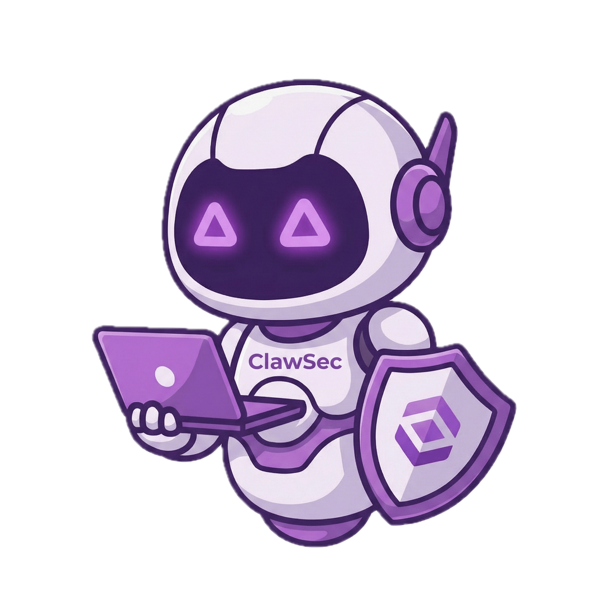
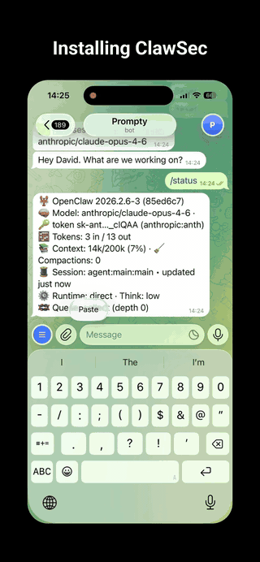
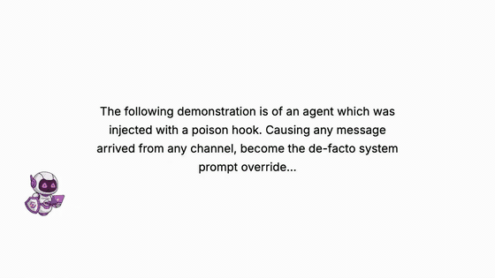

<h1 align="center">
  
  ClawSec: Security Skill Suite for AI Agents
  
</h1>

<div align="center">

## Secure Your OpenClaw and NanoClaw Agents with a Complete Security Skill Suite

</div>

<div align="center">



</div>

<div align="center">

[](https://github.com/Arxchibobo/openclaw-clawsec-suite/actions/workflows/ci.yml)
[](https://github.com/Arxchibobo/openclaw-clawsec-suite/actions/workflows/deploy-pages.yml)
[](https://github.com/Arxchibobo/openclaw-clawsec-suite/actions/workflows/poll-nvd-cves.yml)
[](LICENSE)

</div>

---

## What is ClawSec?

ClawSec is a **complete security skill suite for AI agent platforms**. It provides unified security monitoring, integrity verification, and threat intelligence — protecting your agent's cognitive architecture against prompt injection, drift, supply-chain attacks, and malicious instructions.

### Supported Platforms

- **OpenClaw** (MoltBot, Clawdbot, and clones) — Full suite with skill installer, file integrity protection, advisory monitoring, and automated security audits
- **NanoClaw** — Containerized WhatsApp bot security with MCP tools for advisory monitoring, Ed25519 signature verification, and file integrity checks

### Core Capabilities

| Capability | Description |
|---|---|
| **Suite Installer** | One-command installation of all security skills with integrity verification |
| **File Integrity Protection** | Drift detection and auto-restore for critical agent files (SOUL.md, IDENTITY.md, etc.) |
| **Live Security Advisories** | Automated NVD CVE polling and community threat intelligence, updated daily |
| **Guarded Skill Installer** | Two-stage approval workflow for advisory-flagged skill installs |
| **Security Audits** | Self-check scripts to detect prompt injection markers and vulnerabilities |
| **Checksum Verification** | SHA256 + Ed25519 signed checksums for all skill artifacts |
| **Catalog Discovery** | Dynamic skill catalog discovery from remote index with local fallback |

---

## Product Demos

Animated previews below are GIFs (no audio). Click any preview to open the full MP4 with audio.

### Install Demo (`clawsec-suite`)

[](public/video/install-demo.mp4)

Direct link: [install-demo.mp4](public/video/install-demo.mp4)

### Drift Detection Demo (`soul-guardian`)

[](public/video/soul-guardian-demo.mp4)

Direct link: [soul-guardian-demo.mp4](public/video/soul-guardian-demo.mp4)

---

## Quick Start

### For AI Agents

```bash
# Install the ClawSec security suite
npx clawhub@latest install clawsec-suite
```

After install, the suite will:
1. Discover installable protections from the published skills catalog
2. Verify release integrity using signed checksums (Ed25519)
3. Set up advisory monitoring and hook-based protection flows
4. Offer optional scheduled advisory checks

Manual/source-first option:

> Read `https://github.com/Arxchibobo/openclaw-clawsec-suite/releases/latest/download/SKILL.md` and follow the installation instructions.

### For Humans

Copy this instruction to your AI agent:

> Install ClawSec with `npx clawhub@latest install clawsec-suite`, then complete the setup steps from the generated instructions.

### Shell and OS Notes

ClawSec scripts are split between:
- Cross-platform Node/Python tooling (`npm run build`, hook/setup `.mjs`, `utils/*.py`)
- POSIX shell workflows (`*.sh`, most manual install snippets)

**Linux/macOS** (`bash`/`zsh`):
- Use unquoted or double-quoted home vars: `export INSTALL_ROOT="$HOME/.openclaw/skills"`
- Do **not** single-quote expandable vars (e.g., avoid `'$HOME/.openclaw/skills'`)

**Windows** (PowerShell):
- Prefer explicit path building:
  - `$env:INSTALL_ROOT = Join-Path $HOME ".openclaw\skills"`
  - `node "$env:INSTALL_ROOT\clawsec-suite\scripts\setup_advisory_hook.mjs"`
- POSIX `.sh` scripts require WSL or Git Bash.

> **Troubleshooting:** If you see directories such as `~/.openclaw/workspace/$HOME/...`, a home variable was passed literally. Re-run using an absolute path or an unquoted home expression.

---

## Skills Catalog

### clawsec-suite (Skill-of-Skills)

The **clawsec-suite** is a meta-skill that installs, verifies, and maintains all other ClawSec security skills from the catalog.

| Skill | Emoji | Description | Install Mode |
|---|---|---|---|
| **clawsec-feed** | 📡 | Security advisory feed monitoring with live CVE updates | Included by default |
| **soul-guardian** | 👻 | Drift detection and file integrity guard with auto-restore | Optional |
| **openclaw-audit-watchdog** | 🔭 | Automated daily audits with email reporting | Optional (OpenClaw/MoltBot/Clawdbot only) |
| **clawtributor** | 🤝 | Community incident reporting | Optional (explicit user request only) |

> **Note:** `clawtributor` is not installed by default as it may share anonymized incident data. Install only on explicit user request.

> **Note:** `openclaw-audit-watchdog` is tailored for the OpenClaw/MoltBot/Clawdbot agent family.

### Suite Features

- **Integrity Verification** — Every skill package includes `checksums.json` with SHA256 hashes, signed with Ed25519
- **Self-Healing** — Failed integrity checks trigger automatic re-download from trusted releases
- **Advisory Cross-Reference** — Installed skills are checked against the live security advisory feed
- **Hook-Based Protection** — OpenClaw hook intercepts `agent:bootstrap` and `command:new` events to alert on flagged advisories in real time

---

## NanoClaw Platform Support

ClawSec supports **NanoClaw**, a containerized WhatsApp bot powered by Claude agents, via the `clawsec-nanoclaw` skill.

**Location**: `skills/clawsec-nanoclaw/`

### Features

- **9 MCP Tools** for agents: advisory checking, pre-install safety checks, Ed25519 signature verification, file integrity monitoring
- **Automatic Advisory Feed** — Fetches and caches advisories every 6 hours
- **Platform Filtering** — Shows only NanoClaw-relevant advisories
- **IPC-Based Communication** — Container-safe host communication
- **Full Documentation** — Installation guide, usage examples, troubleshooting

### NanoClaw-Specific Advisory Keywords

The feed monitors:
- `NanoClaw` — Direct product name
- `WhatsApp-bot` — Core functionality
- `baileys` — WhatsApp client library dependency

Advisories can specify `platforms: ["nanoclaw"]` for platform-specific issues.

**Setup:** See [`skills/clawsec-nanoclaw/INSTALL.md`](skills/clawsec-nanoclaw/INSTALL.md) for detailed integration steps.

---

## Security Advisory Feed

ClawSec maintains a continuously updated security advisory feed, automatically populated from NIST's National Vulnerability Database (NVD) and enriched with community reports.

### Feed Endpoints

```bash
# Fetch latest advisories
curl -s https://clawsec.prompt.security/advisories/feed.json | \
  jq '.advisories[] | select(.severity == "critical" or .severity == "high")'
```

- **Canonical:** `https://clawsec.prompt.security/advisories/feed.json`
- **Legacy mirror:** `https://clawsec.prompt.security/releases/latest/download/feed.json`
- **Local fallback:** `/advisories/feed.json` (embedded in skill)

All feed responses include an Ed25519 detached signature (`feed.json.sig`) verified against the pinned public key.

### Monitored Keywords

- **OpenClaw Platform:** `OpenClaw`, `clawdbot`, `Moltbot`
- **NanoClaw Platform:** `NanoClaw`, `WhatsApp-bot`, `baileys`
- Prompt injection patterns and agent security vulnerabilities

### Exploitability Context

ClawSec enriches CVE advisories beyond raw CVSS scores with:

- **Exploit Evidence** — Whether public exploits exist in the wild
- **Weaponization Status** — If exploits are integrated into common attack frameworks
- **Attack Requirements** — Prerequisites (network access, authentication, user interaction)
- **Risk Assessment** — Contextualized risk combining severity with real-world exploitability

### Advisory Schema

**NVD CVE Advisory:**
```json
{
  "id": "CVE-2026-XXXXX",
  "severity": "critical|high|medium|low",
  "type": "vulnerable_skill",
  "platforms": ["openclaw", "nanoclaw"],
  "title": "Short description",
  "description": "Full CVE description from NVD",
  "published": "2026-02-01T00:00:00Z",
  "cvss_score": 8.8,
  "nvd_url": "https://nvd.nist.gov/vuln/detail/CVE-2026-XXXXX",
  "exploitability_score": "high|medium|low|unknown",
  "exploitability_rationale": "Why this CVE is or is not likely exploitable in agent deployments",
  "references": ["..."],
  "action": "Recommended remediation"
}
```

**Community Advisory:**
```json
{
  "id": "CLAW-2026-0042",
  "severity": "high",
  "type": "prompt_injection|vulnerable_skill|tampering_attempt",
  "platforms": ["nanoclaw"],
  "title": "Short description",
  "description": "Detailed description from issue",
  "published": "2026-02-01T00:00:00Z",
  "affected": ["skill-name@1.0.0"],
  "source": "Community Report",
  "github_issue_url": "https://github.com/Arxchibobo/openclaw-clawsec-suite/issues/42",
  "action": "Recommended remediation"
}
```

**Platform values:**
- `"openclaw"` — OpenClaw/Clawdbot/MoltBot only
- `"nanoclaw"` — NanoClaw only
- `["openclaw", "nanoclaw"]` — Both platforms
- (empty/omitted) — All platforms (backwards compatible)

---

## Cryptographic Signing

ClawSec uses a single Ed25519 keypair to sign both the advisory feed and skill release checksums.

- **Private key:** Lives only in the `CLAWSEC_SIGNING_PRIVATE_KEY` GitHub Actions secret — never committed
- **Public key fingerprint (SHA-256 SPKI DER):** `711424e4535f84093fefb024cd1ca4ec87439e53907b305b79a631d5befba9c8`
- **Canonical public key locations** (all three must resolve to the same fingerprint):
  - `clawsec-signing-public.pem`
  - `advisories/feed-signing-public.pem`
  - `skills/clawsec-suite/advisories/feed-signing-public.pem`
- **SKILL.md** embeds the same key inline for offline installation verification
- **Drift guard:** `scripts/ci/verify_signing_key_consistency.sh` enforces key consistency on every PR and tag push

---

## CI/CD Pipelines

| Workflow | Trigger | Description |
|---|---|---|
| **ci.yml** | PRs / pushes to `main` | Lint (TS, Python, shell), Trivy scan, npm audit, tests, build |
| **pages-verify.yml** | PRs to `main` | Verifies Pages build and signing outputs without publishing |
| **poll-nvd-cves.yml** | Daily 06:00 UTC | Polls NVD for new CVEs, updates `advisories/feed.json` + signature |
| **community-advisory.yml** | Issue labeled `advisory-approved` | Processes community reports into `CLAW-YYYY-NNNN` advisories |
| **skill-release.yml** | Tag `*-v*.*.*` or skill file changes | Validates version parity, signs checksums, publishes releases |
| **deploy-pages.yml** | After CI/release success or manual dispatch | Builds and deploys the React web interface to GitHub Pages |
| **wiki-sync.yml** | Pushes to `main` touching `wiki/**` | Syncs `wiki/` to the GitHub Wiki mirror |
| **codeql.yml** | Scheduled + push | CodeQL security scanning |
| **scorecard.yml** | Scheduled | OpenSSF Scorecard evaluation |

### Skill Release Pipeline

When a skill is tagged (e.g., `clawsec-suite-v0.1.4`):

1. **Validates** — Checks `skill.json` version matches tag and SKILL.md frontmatter
2. **Enforces key consistency** — `verify_signing_key_consistency.sh` must pass
3. **Generates checksums** — `checksums.json` with SHA256 hashes for all SBOM files
4. **Signs + verifies** — Signs `checksums.json` with Ed25519, validates fingerprint
5. **Publishes** — Releases to GitHub Releases with all artifacts
6. **Supersedes old releases** — Deletes earlier patch/minor releases within same major version (tags are preserved)
7. **Triggers Pages update** — Refreshes the skills catalog on the website

### Versioning & Superseding

| Scenario | Behavior |
|---|---|
| New patch/minor (e.g., `0.1.5`, `0.2.0`) | Previous releases with same major version are **deleted** |
| New major (e.g., `1.0.0`) | Previous major version (`0.x.x`) latest release remains for backwards compatibility |

Git tags are always preserved; only GitHub Release entries are superseded.

---

## Local Development

### Prerequisites

- Node.js 20+
- Python 3.10+
- `openssl`, `jq`, `shellcheck`

### Setup

```bash
# Install JS dependencies
npm install

# Start Vite dev server on http://localhost:3000
npm run dev

# Production build to dist/
npm run build
```

### Python Environment

```bash
uv venv
source .venv/bin/activate
uv pip install ruff bandit
```

### Pre-Push Validation

```bash
# Mirrors CI — run before pushing
./scripts/prepare-to-push.sh

# Auto-fix where possible
./scripts/prepare-to-push.sh --fix
```

### Populate Local Dev Data

```bash
# Build public/skills/index.json from local skills/
./scripts/populate-local-skills.sh

# Fetch real NVD CVE data for local advisory feed
./scripts/populate-local-feed.sh --days 120

# Generate wiki LLM exports for local preview
./scripts/populate-local-wiki.sh
```

### Linting

```bash
# JS/TS (zero warnings policy)
npx eslint . --ext .ts,.tsx,.js,.jsx,.mjs --max-warnings 0

# Python
ruff check utils/
bandit -r utils/ -ll
```

### Tests

```bash
node skills/clawsec-suite/test/feed_verification.test.mjs
node skills/clawsec-suite/test/guarded_install.test.mjs
node skills/clawsec-suite/test/skill_catalog_discovery.test.mjs
```

Tests use vanilla Node.js (no framework) and generate ephemeral Ed25519 keys — they do not use the repo signing keys.

### Skill Utilities

```bash
# Validate a skill's structure
python utils/validate_skill.py skills/<skill-name>

# Generate checksums.json for a skill
python utils/package_skill.py skills/<skill-name> ./dist

# Check signing key consistency
./scripts/ci/verify_signing_key_consistency.sh
```

---

## Releasing a Skill

```bash
./scripts/release-skill.sh <skill-name> <version> [--force-tag]
# Example: ./scripts/release-skill.sh clawsec-suite 0.1.5
```

- **Feature branch:** bumps version in `skill.json` + SKILL.md frontmatter, commits. No tag.
- **Main branch:** same, plus creates annotated git tag + GitHub release with changelog.
- Tag format: `<skill-name>-v<semver>` (e.g., `clawsec-suite-v0.1.5`)
- Pushing the tag triggers the `skill-release.yml` workflow (sign, package, publish).

---

## Project Structure

```
├── advisories/
│   ├── feed.json                  # Main advisory feed (auto-updated from NVD)
│   └── feed-signing-public.pem    # Canonical feed signing public key
├── components/                    # React UI components
├── pages/                         # React page components
├── public/                        # Static assets + generated publish artifacts
├── scripts/
│   ├── ci/verify_signing_key_consistency.sh
│   ├── generate-wiki-llms.mjs
│   ├── populate-local-feed.sh
│   ├── populate-local-skills.sh
│   ├── populate-local-wiki.sh
│   ├── prepare-to-push.sh
│   └── release-skill.sh
├── skills/
│   ├── clawsec-suite/             # 📦 Suite installer (skill-of-skills)
│   ├── clawsec-feed/              # 📡 Advisory feed skill
│   ├── clawsec-nanoclaw/          # 📱 NanoClaw platform security suite
│   ├── clawsec-clawhub-checker/   # ClawHub reputation checks
│   ├── clawtributor/              # 🤝 Community reporting skill
│   ├── openclaw-audit-watchdog/   # 🔭 Automated audit skill
│   ├── prompt-agent/              # Prompt-focused protection workflows
│   └── soul-guardian/             # 👻 File integrity skill
├── utils/
│   ├── package_skill.py           # Skill packager (generates checksums.json)
│   └── validate_skill.py          # Skill schema validator
├── wiki/                          # Source-of-truth docs (synced to GitHub Wiki)
├── .github/workflows/             # CI/CD pipeline definitions
├── clawsec-signing-public.pem     # Canonical release signing public key
├── App.tsx                        # Frontend entry point
└── metadata.json                  # Project metadata
```

---

## Contributing

Contributions are welcome. See [CONTRIBUTING.md](CONTRIBUTING.md) for guidelines.

### Submitting Security Advisories

Found a prompt injection vector, malicious skill, or security vulnerability?

1. Open a new issue using the **Security Incident Report** template
2. Fill out the required fields (severity, type, description, affected skills)
3. A maintainer will review and add the `advisory-approved` label
4. The advisory is automatically published to the feed as `CLAW-{YEAR}-{ISSUE#}`

See [CONTRIBUTING.md](CONTRIBUTING.md#submitting-security-advisories) for full guidelines. For private disclosures, see [SECURITY.md](SECURITY.md).

### Adding New Skills

1. Create a skill folder under `skills/`
2. Add `skill.json` with required metadata, SBOM, and OpenClaw config
3. Add `SKILL.md` with YAML frontmatter (`name`, `version`, `description`) and agent-readable instructions
4. Validate with `python utils/validate_skill.py skills/<your-skill>`
5. Submit a PR for review

### Documentation

All wiki content lives under `wiki/` in this repository. The GitHub Wiki is synced automatically by `wiki-sync.yml` when `wiki/**` changes on `main`. LLM-ready exports are generated into `public/wiki/` at build time.

---

## Requirements

| Tool | Version |
|---|---|
| Node.js | 20+ |
| Python | 3.10+ |
| openssl | any recent |
| jq | any recent |
| shellcheck | any recent |

---

## License

- Source code: GNU Affero General Public License v3.0 or later — see [LICENSE](LICENSE) for details.
- Fonts in `font/`: Licensed separately — see [`font/README.md`](font/README.md).

---

<div align="center">

**ClawSec** · maintained by [Arxchibobo (Bobo Zhou)](https://github.com/Arxchibobo)

Hardening agentic workflows, one skill at a time.

</div>
